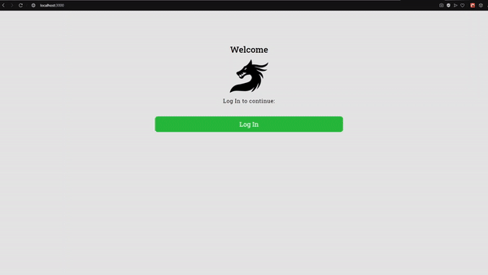

💻 Este projeto foi criado para o processo de seleção da Compasso - UOL. 💻

# Compasso-Dragons

## Scripts e Comandos

Para você rodar o projeto é possível utilizar:

### `yarn (ou npm) install` ✔

Para instalar as dependencias corretas para rodar o projeto.

### `yarn start` 💡

Para rodar o app em servidor local e desenvolve-lo. 
Abra [http://localhost:3000](http://localhost:3000) no seu navegador.

### `yarn test` 🔨

Efetua os testes da aplicação. 
leia mais sobre modo de testes em: [running tests](https://facebook.github.io/create-react-app/docs/running-tests) .

### `yarn build` 🛠

Cria o app para produção na pasta `build` . 
Cria o bundle corretamente do React para melhor performance.
 
Seu app está pronto para ser lançado! 🚀

Saiba mais sobre builds e deploys [deployment](https://facebook.github.io/create-react-app/docs/deployment) .

## Saiba Mais 

Meus repositórios [MecBonjourno](github.com/MecBonjourno/).

Projetos e Trabalhos realizados [The Za Co](https://theza.co/).
